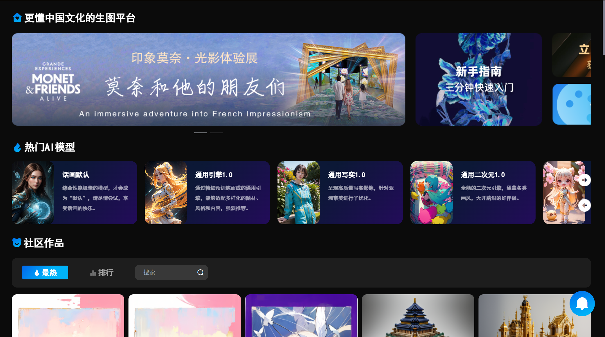



[Chinese Version](./cv.md)

Contact Information
======
- Phone: 18072015070
- Email: neverbiasu67@163.com
- Address: No. 998, Xueyuan Street, Baiyang Street, Qiantang District, Zhejiang Province, Zhejiang College of Media and Communications

Personal Summary
======
In the field of computer vision, I have served as a project leader for relevant projects and have received provincial-level funding. Technically, I am proficient in using PyTorch to replicate models such as GANs and Transformers, and have applied these techniques in projects involving style transfer and image generation. Additionally, I am skilled in C++ and have a basic understanding of Shell scripting and Linux operating systems. As the first author of a conference paper on face style transfer published in an EI conference, I have showcased my research direction and efforts.

Education
======
* 2021 - 2025: Digital Media Technology, Zhejiang College of Media and Communications
  * Program Ranking: Top 15%
  * Major Courses: Computer Graphics, Introduction to Artificial Intelligence, C++, Human-Computer Interaction, Data Structures and Algorithms
  * Campus Roles: Minister of Student Union, Laboratory Head, Assistant Teacher for Introduction to Artificial Intelligence course
  * Internship or Project Experience: Stable Diffusion website construction project and facial style transfer platform
  * Awards: New Talent Project, "Outstanding Student Cadre"
  * Research Achievements: One EI paper published
  * Proficient Skills: Paper reproduction, script writing, IELTS 6.0, CET-6 (English proficiency test)

Skills
======
* Python
* Pytorch
* Jupyter
* Linux
* C++
* Git
* SQL

Languages
======
* English
* Chinese

Project Experience
======
### Application of AIGC in Photography Field (2023.1-2024.1)
- **Responsibilities**: Data mining and analysis, AI model research and deployment
- **Technological Application**: Mainly utilized the Stable Diffusion model
- **Achievements**: Project successfully launched, received provincial-level funding
- **Project Image**: 

### Interactive Facial Style Transfer and Aesthetic Evaluation Platform (2023.8-Present)
- **Responsibilities**: Project Leader
- **Technological Highlights**: Applied reinforcement learning to construct an aesthetic evaluation model, utilizing Python, FastAPI, Docker, MySQL, and React
- **Accomplishments**: Published an EI conference paper, demonstrating the research value of the project
- **Project Image**: 