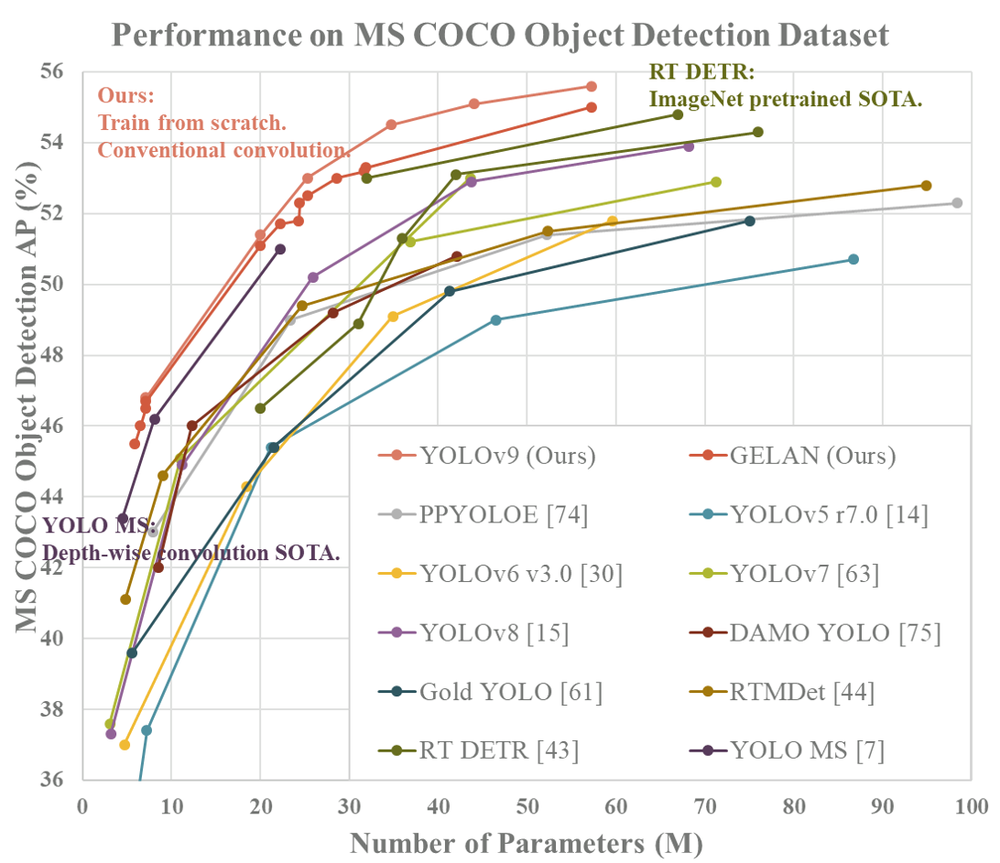
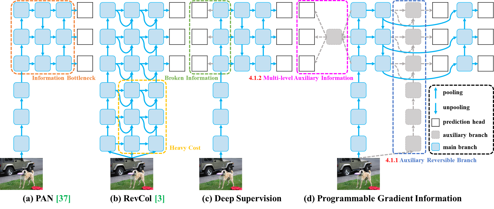
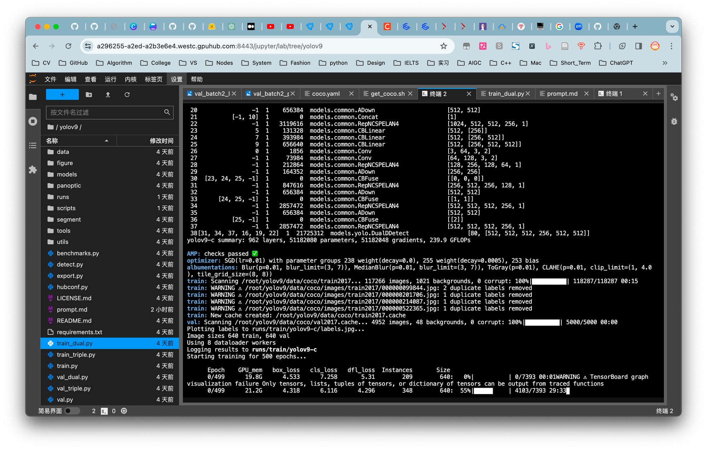
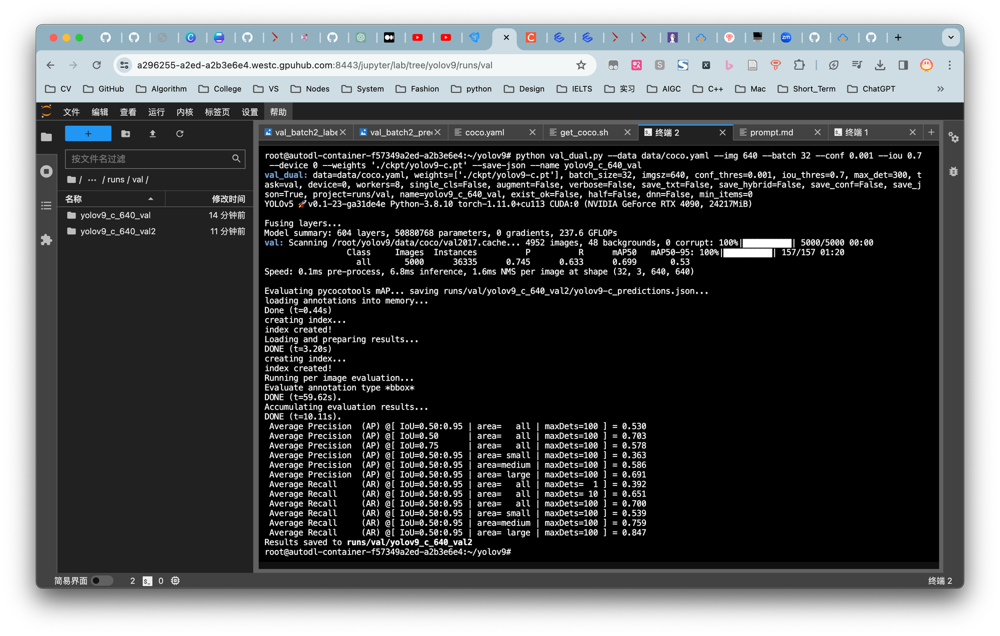
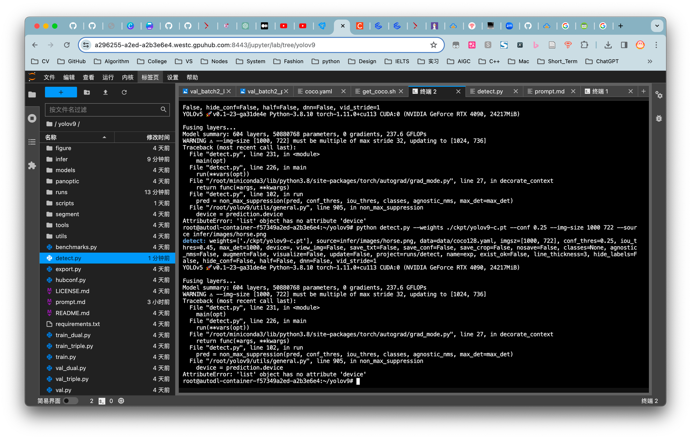
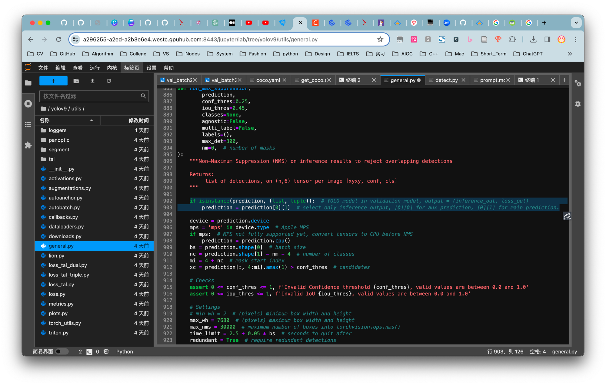
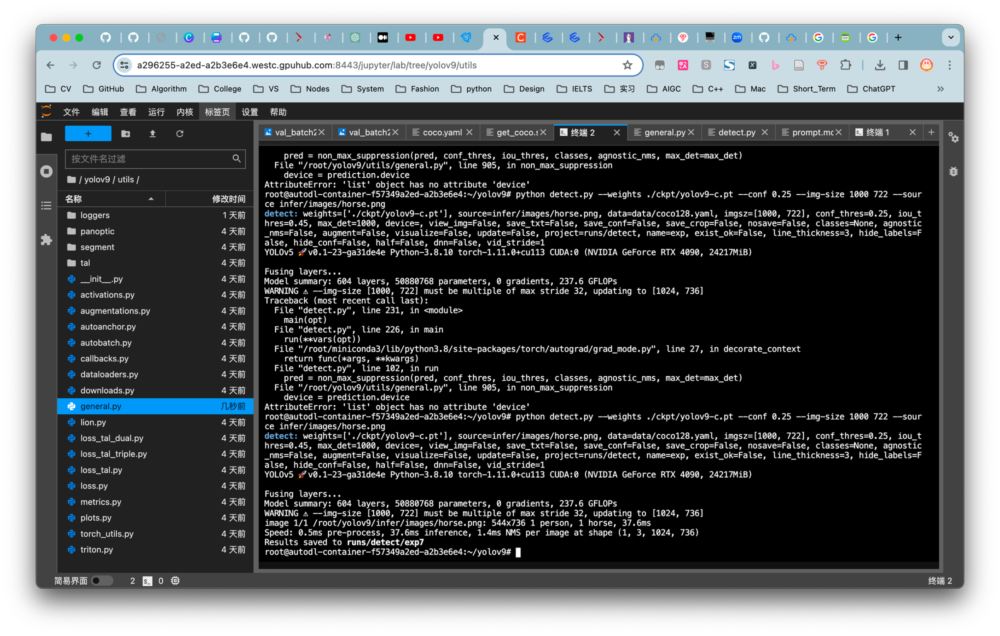

# YOLOv9最新最全代码复现
## 导航

- [YOLOv9最新最全代码复现](#yolov9最新最全代码复现)
  - [导航](#导航)
  - [引言](#引言)
    - [YOLOv9模型概述](#yolov9模型概述)
      - [模型框架图](#模型框架图)
  - [环境搭建及训练推理](#环境搭建及训练推理)
    - [环境配置](#环境配置)
    - [数据集准备](#数据集准备)
    - [训练过程](#训练过程)
    - [测试和评估](#测试和评估)
    - [实践应用](#实践应用)
  - [更多](#更多)
    - [配套视频](#配套视频)
    - [报错修复](#报错修复)
    - [总结和展望](#总结和展望)
    - [参考链接](#参考链接)

## 引言

在目标检测领域，YOLO系列始终是速度与准确性的标杆。最新进展的YOLOv9，在《YOLOv9: Learning What You Want to Learn Using Programmable Gradient Information》一文中展示了其性能的进一步提升。特别值得一提的是，即使在未采用Transformer结构的情况下，相较于RT-DETR、Yplov8等采用Transformer结构的模型，YOLOv9展现出了更为卓越的性能。本篇文章旨在详尽介绍YOLOv9的复现过程，包括环境配置、数据准备、模型训练与评估等关键步骤。该论文由YOLOv4、YOLOv7的作者王建尧博士撰写，对于目标检测领域的爱好者和研究者而言，无疑是一篇值得深入阅读的佳作。

fig.1. 模型表现图
### YOLOv9模型概述

YOLOv9沿袭了YOLO系列一贯的完全卷积结构，通过引入“Programmable Gradient Information”技术，增强了模型学习目标特征的灵活性，使其在多个标准数据集上实现了最佳状态（SOTA）。尤其在MS COCO数据集上，YOLOv9不同版本的模型在多项性能指标上均实现了显著提升。
#### 模型框架图
YOLOv9的模型框架设计体现了其对效率和性能的双重追求。核心改进包括：
深度可编程特征提取器：YOLOv9采用了先进的深度可编程特征提取器，这使得模型能够根据不同的检测任务自动调整其结构和参数，从而提高学习效率和适应性。

1. 有序列表增强特征金字塔网络（FPN）：为了提升对小物体的检测能力，YOLOv9对特征金字塔网络的设计进行了增强，通过更有效的跨尺度连接和特征融合机制，增强了模型对于不同尺寸目标的识别精度。

2. 有序列表多尺度训练和推理：YOLOv9实现了在训练和推理阶段的多尺度处理能力，通过动态调整输入图像的尺寸，使模型能够更加鲁棒地处理各种分辨率的图像，进一步提升了模型的泛化能力。

3. 有序列表这些创新不仅提升了YOLOv9在目标检测领域的性能，也为未来的研究和应用提供了新的思路和可能性。

fig.2. 模型框架图

## 环境搭建及训练推理
### 环境配置

复现YOLOv9需要首先准备适宜的开发环境。我们推荐使用AutoDL平台，借助我已经准备好的环境镜像，可以免去繁琐的环境配置和数据集准备工作。
[镜像地址](https://www.autodl.com/create?image=WongKinYiu/yolov9/master:v1.3)

通过以下步骤可快速搭建：

1. 克隆官方代码库：

```bash
git clone <https://github.com/WongKinYiu/yolov9.git>
cd yolov9
```

2. 安装必要的Python依赖：

```bash
pip install -r requirements.txt -i <https://pypi.tuna.tsinghua.edu.cn/simple/>
```

使用清华大学的Python包镜像站点，以加快下载速度。

### 数据集准备

使用官方提供的脚本`scripts/get_coco.sh`下载并准备MS COCO数据集。该脚本会自动下载并解压数据集及标注文件。需要确保**数据集目录结构正确**，以便YOLOv9能正确读取数据。
```jsx
bash scripts/get_coco.sh
```
建议下载到autodl-tmp目录再解压回文件目录，需要修改get_coco.sh的代码的第6、10、13、20行的代码

也可以从以下网盘链接下载再解压。
[网盘链接](https://pan.baidu.com/s/1EbwMmhaTwV5HNMayjxrLig?pwd=67cc)
推荐的数据集文件目录
```
├── annotations
│   └── instances_val2017.json
├── images
│   ├── train2017
│   └── val2017
├── labels
│   ├── train2017
│   └── val2017
├── LICENSE
├── README.txt
├── test-dev2017.txt
├── train2017.cache
├── train2017.txt
├── val2017.cache
└── val2017.txt
```
### 训练过程

YOLOv9的训练支持单卡和多卡配置。以下是单卡训练的一个示例命令：

```bash
python train_dual.py --workers 8 --device 0 --batch 16 --data data/coco.yaml --img 640 --cfg models/detect/yolov9.yaml --weights '' --name yolov9 --hyp hyp.scratch-high.yaml --min-items 0 --epochs 500 --close-mosaic 15
```

多卡训练能够显著提升训练速度和效率，但对硬件资源的要求更高。由于训练数据量庞大，此处将训练轮次调整为1轮，在配置有4090 GPU的环境下，预计训练时间接近1小时。


fig.3. 模型训练图
如图可以看出，训练所需显存至少要24G，因此这里推荐使用3090或4090。
输出的结果在runs/train/yolov9/weights中。
其中best.pt是最好的（损失最小）模型，last.pt是最新的模型。

### 测试和评估

使用训练好的模型(也可以用镜像放置在ckpt文件夹下的模型）进行测试和评估，可以通过以下命令执行：

```bash
python val_dual.py --data data/coco.yaml --img 640 --batch 32 --conf 0.001 --iou 0.7 --device 0 --weights './yolov9-c.pt' --save-json --name yolov9_c_640_val
```

AP（平均精度）是评估目标检测模型性能的关键指标，YOLOv9在这一指标上的提升体现了其优越性。

fig.4. 模型推理图
结果保存在runs/val中
### 实践应用

YOLOv9可用于图片和视频的目标检测，以下是测试单张图片的命令示例：

```bash
python detect.py --weights ./ckpt/yolov9-c.pt --conf 0.25 --img-size 1024 768 --source infer/images/horses.jpg --device 0
```
此命令将输出图片的检测结果

在此环节中出现了些许问题，现已解决。

fig.5. 结果图 

## 更多
### 配套视频
<iframe src="//player.bilibili.com/player.html?aid=1151291935&bvid=BV1fZ421y7GS&cid=1458204749&p=1" scrolling="no" border="0" frameborder="no" framespacing="0" allowfullscreen="true"> </iframe>

### 报错修复

fig.6. detect运行中发生的错误
通过查看issues可知可通过修改utils/general.py文件夹中的902行可解决。

fig.7. 正确代码
成功解决

fig.8. 成功推理结果
### 总结和展望

通过复现YOLOv9，我们不仅深入了解了其核心技术和实现方法，还体验了从环境配置到模型训练、评估的整个过程。YOLOv9在目标检测领域的高适用性和优异性能，使其成为未来研究和应用的重要基石。随着技术的进一步发展，期待YOLOv9在更多场景下的应用和优化。

### 参考链接

- YOLOv9 GitHub仓库：https://github.com/WongKinYiu/yolov9
- YOLOv9 论文：https://arxiv.org/abs/2402.13616